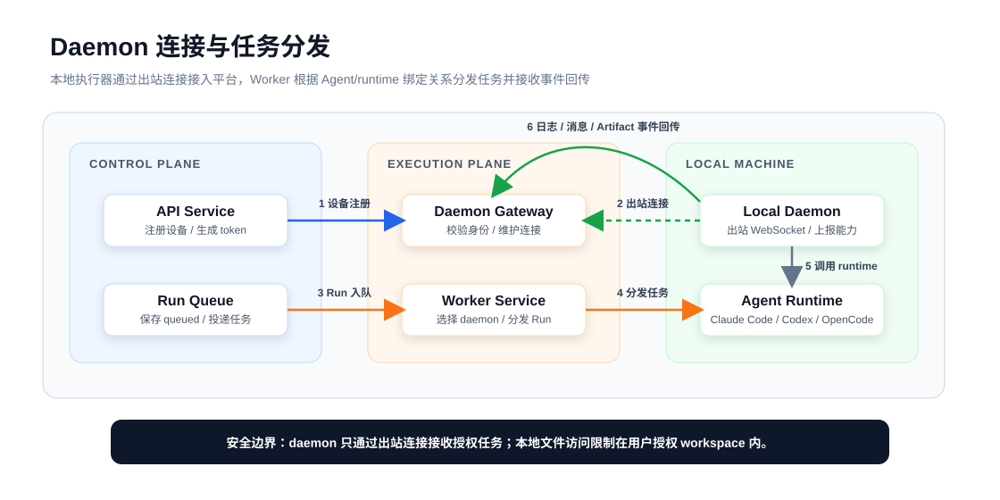
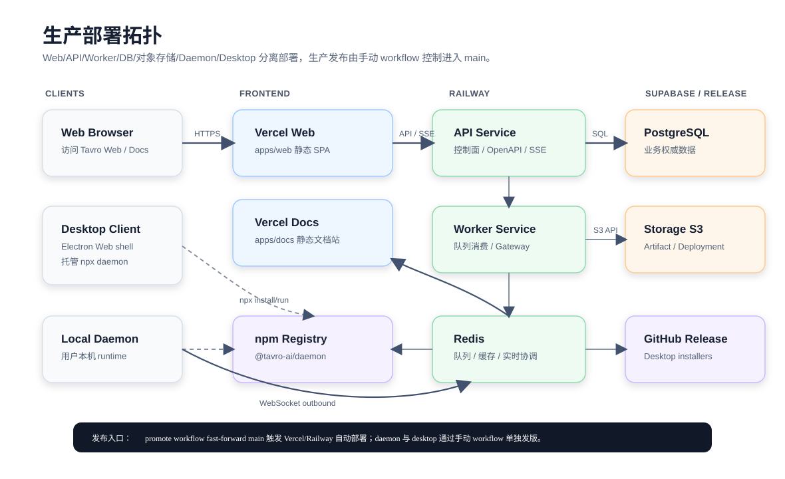

# Tavro/AgentHub 课题技术报告大纲

## 文档定位

本文档用于课题提交场景，定位为技术报告，不等同于 `apps/docs` 中面向用户的产品文档。报告主名称使用 **Tavro**，首次出现时说明 Tavro 的原型工程名与代码仓库名为 **AgentHub**。

报告主线以工程完整性为骨架，以多 Agent 协作、本地执行器、产物闭环和 AI 辅助工程协作方法作为技术创新亮点。目标篇幅约 20 页正文，附录可放关键截图、部署地址、GitHub 仓库、演示视频二维码等材料。

## 摘要

本课题名为 **Agent Hub**，产品实现命名为 **Tavro**。Agent Hub 面向大模型 Agent 从单轮问答走向持续协作、工具调用和自动化执行的趋势，设计并实现了一个基于 IM 交互范式的多 Agent 协作平台。用户可以像使用即时通讯工具一样创建会话、发送消息、@ 不同 Agent，并在同一工作流中查看任务进度、运行日志、生成文件、网页预览和部署记录。

当前 Claude Code、Codex、OpenCode 等 Agent 工具大多以命令行或单机工具形态存在，存在多人协作困难、运行过程不可视、长任务难追踪、本地环境与线上平台难协同、生成产物缺少统一管理等问题。针对这些问题，Agent Hub 将用户交互、控制面、执行面和本地运行环境进行分层设计：前端采用纯静态 Web SPA 与桌面客户端共享工作台界面；后端 API 负责认证、权限、会话历史、Agent 管理和 OpenAPI 路由；Worker 负责长任务队列消费和运行事件持久化；本地 daemon 通过出站连接接入用户电脑上的 Agent runtime；PostgreSQL、Redis 和对象存储分别承担业务数据、队列缓存和产物文件存储。

本课题最终形成了可运行的 Tavro 原型系统，已支持 GitHub 登录、单 Agent 私聊、群聊/项目会话、Agent 管理、Run 状态跟踪、结构化任务卡片、Artifact 工作区、静态站点预览、桌面客户端和本地执行器托管等能力。系统已完成线上部署，并具备演示、测试和后续扩展基础。通过该实现，Agent Hub 验证了以 IM 工作台统一多 Agent 协作、本地执行和产物管理的可行性。

## 第 1 章 课题概述

### 1.1 课题背景

近年来，大语言模型应用正在从单轮问答逐步发展为能够理解上下文、调用工具、执行多步骤任务的 Agent 系统。与传统聊天机器人相比，Agent 不再只负责生成文本回答，而是可以结合代码仓库、命令行工具、文件系统、外部 API 和自动化流程完成更复杂的工作。例如在软件开发场景中，Agent 可以阅读代码、定位问题、生成补丁、运行测试并给出修改说明；在内容生产场景中，Agent 可以生成文档、网页和结构化产物。

随着 Claude Code、Codex、OpenCode 等工具出现，命令行形态的 AI Agent 已经具备较强的本地执行能力。这类工具可以直接访问用户机器上的代码仓库和开发环境，因此在真实工程任务中具有很高价值。然而，它们通常以单机、单用户、单任务方式运行，交互入口主要是终端或独立 CLI，会话历史、任务状态、执行日志和生成产物往往分散在不同位置，难以形成面向团队协作和长期工作的统一工作台。

本课题基于上述背景提出 **Agent Hub**，并将产品实现命名为 **Tavro**。课题希望以即时通讯工具中用户熟悉的会话交互为基础，把 Agent 作为聊天成员接入工作流，让用户通过创建会话、发送消息和 @ Agent 的方式发起任务，并在同一界面中持续查看运行事件、任务拆分、生成产物和部署结果。

### 1.2 问题与需求

现有 CLI Agent 在单人本地任务中表现直接高效，但当任务复杂度提升后，会暴露出运行过程不可视、协作上下文难沉淀、本地环境与线上平台割裂、生成产物缺少统一管理等问题。一个 Agent 任务可能持续数分钟甚至更久，期间经历排队、启动、读取上下文、调用工具、生成结果和失败重试等状态。如果这些状态只散落在终端输出中，用户很难清晰判断任务当前进展，也难以在任务结束后回溯关键日志和决策过程。

从使用角色看，系统需要同时服务三类对象：普通用户是会话发起者、任务确认者和产物使用者；Agent/runtime 是任务执行者，负责调用本地或远程工具并回传消息、日志和产物；API、Worker、数据库、Redis、对象存储和实时通道等系统服务则承担控制面、执行面、持久化和同步能力。Web 与桌面端只负责交互展示和用户确认，不应承担长任务执行；daemon 也不是第二套后端，而是运行在用户本机、负责连接本地 runtime 的轻量执行器。

从功能边界看，Agent Hub 需要提供 GitHub 登录、用户会话、单 Agent 私聊、群聊、项目会话、Agent 管理、Run 状态跟踪、协调者调度、Goal/Task 拆分、Artifact 展示与发布、本地 daemon 接入、桌面端托管执行器和实时反馈等能力。复杂任务需要从用户自然语言请求拆解为阶段性目标和可执行任务，并由协调者选择合适的 Agent 推进，避免多 Agent 协作停留在聊天文本层面。这些功能共同支撑一个核心目标：让用户在同一工作台中发起任务、观察执行过程、接收 Agent 回复并管理最终产物。

从非功能边界看，系统必须保证长任务脱离 HTTP 请求生命周期，由 Worker 和 daemon 承担执行；本地执行器必须通过出站连接接入平台，避免暴露用户机器端口；Web 前端应保持纯静态 SPA，API、Worker、数据库、Redis 和对象存储应支持分离部署；Run 状态、运行事件、消息和产物元数据需要持久化，保证系统可观测、可恢复、可测试。

### 1.3 课题目标

本课题的目标是设计并实现一个名为 **Agent Hub** 的多 Agent 协作平台，产品实现名为 **Tavro**。系统以 IM 聊天作为核心交互范式，让用户可以像使用聊天工具一样创建工作会话、发送任务消息、@ 一个或多个 Agent，并在会话中持续查看任务拆分、运行进度、Agent 回复和生成产物。

在工程实现上，课题目标不是简单封装某一个 CLI Agent，而是构建一套可扩展的 Agent 工作台。系统采用 Web、API、Worker、daemon 分层架构：Web 和桌面端负责交互展示；API 作为控制面负责认证、权限、会话和元数据；Worker 在 HTTP 请求之外执行长任务并持久化运行事件；daemon 作为用户本机的轻量执行器，通过出站连接接收授权任务并调用本地 runtime。

最终，Agent Hub 希望验证一种以 IM 工作台统一多 Agent 协作、本地执行和产物管理的技术路线，使 Agent 不再只是分散的命令行工具，而是可以进入有状态、可追踪、可协作、可部署的工程工作流。

### 1.4 主要工作

围绕上述目标，本文主要完成以下工作：

- 设计聊天式多 Agent 协作模型。系统将 Agent 抽象为会话成员，支持单 Agent 私聊、群聊、项目会话和 @ Agent 交互，并通过目标、任务和结构化卡片承载多 Agent 分工结果。
- 实现分层系统架构与实时任务链路。系统拆分为 Web/Desktop、API、Worker、daemon、数据库、Redis 和对象存储等部分，使长任务执行、状态持久化和实时推送从普通 HTTP 请求中解耦。
- 实现本地 daemon 与桌面端托管能力。Daemon 负责检测和调用用户本机的 Claude Code、Codex 等 runtime；桌面客户端在复用 Web 工作台的基础上，提供本地执行器启动、状态查看和更新提醒等能力。
- 实现 Artifact 与部署预览产物闭环。系统支持在聊天流中展示生成文件、项目变更、网页预览和部署记录，并通过对象存储解决线上多容器环境中的产物共享问题。
- 完成线上部署、测试验证和演示闭环。系统已部署到 Vercel、Railway、Supabase 等平台，并通过单元测试、集成验证和线上 Demo 证明主要流程可运行。
- 沉淀面向 AI Agent 协作开发的工程规范。项目通过 `AGENTS.md` 和 `skills/` 记录架构边界、开发流程、部署经验和常见排障方法，为后续 AI Agent 参与维护和扩展提供稳定上下文。

## 第 2 章 系统总体设计

### 2.1 总体架构

系统总体架构如下图所示：

> 图源文件：`docs/report/diagrams/system-architecture.drawio`，可使用 diagrams.net 继续编辑。

该架构将系统划分为四个层次：

1. 客户端层：负责把复杂的 Agent 执行过程转化为用户可以理解和操作的工作台体验。客户端层只负责用户交互、消息展示、实时反馈和用户确认，不直接执行 Agent 任务，也不保存业务数据的权威状态。

   1.1 Web SPA：以纯静态前端形式部署在 Vercel，提供登录、会话、消息流、任务页、Artifact 工作区、Daemon 页面等核心工作台能力。

   1.2 Desktop Client：通过 Electron 复用 Web 工作台界面，并补充桌面端能力，例如系统浏览器登录、本地执行器托管和客户端更新提醒。

2. 控制面：负责认证、权限、会话、Agent、Run、Artifact 元数据、OpenAPI 路由和实时推送，关注“谁可以做什么、当前状态是什么、任务应该投递到哪里”。控制面只创建和调度任务，不在 HTTP 请求中直接执行长任务。

   2.1 API Service：承担业务控制入口，管理用户会话、权限校验、会话历史、Agent、Run、Artifact、deployment 和 daemon device 等元数据。

   2.2 Realtime Channel：通过 SSE 或 WebSocket 将消息、运行事件、任务状态和产物变化推送给 Web 与桌面端，使前端视图能够实时反映后台执行结果。

3. 执行面：负责长任务执行、协调者调度、Run 生命周期推进、本地 runtime 调用和日志回传。执行面将耗时任务从 API 请求中解耦，保证控制面保持稳定响应。

   3.1 Worker Service：消费队列中的 Run，承载协调者 Orchestrator 的目标拆分和任务分派流程，选择云端 runtime 或已连接 daemon 执行任务，并写回运行事件、消息、Goal/Task 状态和 Artifact 记录。

   3.2 Daemon Gateway：接入本地 daemon 的出站连接，负责在 Worker 和用户本机 daemon 之间传递授权后的任务与运行事件。

   3.3 Local Daemon：运行在用户电脑上，检测本地 runtime，接收经过授权的任务，调用本地 Claude Code、Codex 等工具，并回传日志、消息、文件和状态。daemon 不负责用户系统、会话历史或全局权限判断，因此不是第二套后端。

   3.4 Agent Runtimes：包括 Claude Code、Codex、OpenCode 等实际执行工具，负责完成代码、文档、网页、项目文件等具体任务。

4. 数据与基础设施层：负责保存权威状态和生成产物，支撑系统恢复、队列缓存、临时状态和跨服务文件共享。

   4.1 PostgreSQL：保存用户、会话、消息、Run、Goal/Task、Artifact、deployment 和 daemon device 等业务数据。

   4.2 Redis：支撑队列、缓存、临时 OAuth state、桌面登录 code 和实时协调。

   4.3 Supabase Storage：保存 Artifact、静态站点和 deployment 文件，避免 API/Worker 分离部署后依赖单个容器本地磁盘。

### 2.2 核心数据流

Run 生命周期与核心数据流如下图所示：

> 图源文件：`docs/report/diagrams/run-lifecycle.drawio`，可使用 diagrams.net 继续编辑。

Tavro 的一次 Agent 执行不是由前端直接调用某个 CLI 完成，而是被抽象为一个可持久化、可排队、可观察的 Run。Run 是用户消息进入执行系统后的核心状态载体：它记录任务从排队、运行到成功或失败的生命周期，也把消息、Goal/Task、运行事件和 Artifact 串联成同一条可追踪链路。

该数据流的关键设计是将控制面请求和长任务执行解耦。用户发送消息时，API 只负责完成权限校验、消息持久化、Run 创建和队列投递，不在 HTTP 请求中等待 Agent 执行完成。真正的耗时任务由 Worker 消费队列后继续推进，并根据 Agent 与 runtime 的绑定关系选择本地 daemon 或云端 runtime。这样可以避免长任务阻塞普通 API 请求，也便于系统在失败、重试、刷新页面或多端查看时恢复状态。

核心流程：

1. 用户在会话中发送消息。
2. API 创建 Run，保存 queued 状态并投递队列。
3. Worker 消费 Run，选择本地 daemon 或云端 runtime。
4. Daemon 或云端 runtime 接收任务并开始执行，产生运行事件和中间状态。
5. 需要多 Agent 协作时，runtime 调用协调者 Orchestrator，根据会话上下文创建 Goal，并在 Goal 下分派多个 Task 给不同 Agent。
6. API/Worker 持久化数据，并通过实时事件推送给前端。
7. 前端更新消息流、Goal/Task 状态和产物视图。

在执行过程中，文本回复、结构化卡片、任务状态和 Artifact 元数据写入 PostgreSQL，生成文件、静态站点和 deployment 文件写入 Supabase Storage。实时通道只承担事件推送职责，不作为权威存储；前端收到事件后更新消息流、任务页和产物视图。如果前端刷新或断线重连，也可以重新从 API 读取数据库中的权威状态。通过这种方式，系统形成了“用户消息创建 Run、Worker 推进执行、runtime 产生产物、数据库保存状态、实时通道反馈前端”的闭环。

### 2.3 Daemon 连接与任务分发

Daemon 连接与任务分发流程如下图所示：

- Daemon 与 Worker gateway 建立出站 WebSocket 连接。
- API 为 daemon 设备生成 token，Worker 校验设备身份。
- Worker 根据 Agent/runtime 绑定关系将 Run 分发到对应 daemon。
- Daemon 执行本地 CLI runtime，并将事件流式回传。

## 第 3 章 关键技术与创新点

### 3.1 IM 化多 Agent 协作范式

Tavro 将多 Agent 协作建模为 IM 工作台，而不是把 Agent 简单封装成一次性工具调用。在这个模型中，Agent 被视为会话成员：用户可以与单个 Agent 私聊，也可以在群聊或项目会话中同时引入多个 Agent。会话保存完整历史消息、参与 Agent、Run、Goal/Task、Artifact、项目上下文和运行状态，使 Agent 能够基于连续上下文理解任务，而不是只处理孤立 prompt。

IM 化设计的关键价值在于降低多 Agent 协作的组织成本。用户仍然使用熟悉的聊天方式发起需求、补充说明和确认结果；系统则在会话内部完成 Agent 选择、任务创建、状态追踪和产物归档。群聊中的 `@Agent` 语义提供了显式调度入口，既可以让用户直接指定某个 Agent，也可以由协调者根据上下文拆分任务并选择合适的执行者。

因此，聊天流在 Tavro 中不只是展示界面，而是协作协议的一部分。普通文本消息用于表达需求和结果，结构化运行事件用于记录任务过程，Artifact 用于承载产物，Goal/Task 卡片用于呈现自动分工。用户看到的是一条连续聊天流，系统内部则把它转化为可持久化、可追踪、可恢复的协作状态。

### 3.2 协调者与 Goal/Task 机制

为避免多 Agent 协作停留在“多个机器人轮流发言”的层面，Tavro 引入了协调者 Orchestrator 与 Goal/Task 机制。Orchestrator 是群聊或项目会话中的调度角色，它不替代具体 Agent 执行任务，而是负责理解用户意图、维护协作上下文、创建阶段性目标，并将目标拆解为可执行任务分派给不同 Agent。

Goal 表示从用户自然语言请求中抽取出的阶段性目标，例如“完成静态网页首页”或“为项目补充部署文档”。Task 是 Goal 下的工作单元，包含标题、描述、负责人 Agent、依赖关系、运行状态和关联 Run。这样的设计使系统能够表达串行与并行协作：没有依赖的任务可以立即派发；存在依赖的任务需要等待上游任务完成后，再由协调者通过审批动作继续推进。为避免同一 Agent 同时处理多个互相影响的任务，系统还约束同一 Goal 内分配给同一 assignee 的任务默认串行，后续任务通过依赖关系指向前序任务。

在实现上，协调者通过 `create_goal`、`create_task`、`approve_task`、`complete_goal` 等工具调用改变系统状态。`create_task` 和 `approve_task` 不只是生成一段文本，而是会创建可见的任务分派卡片、启动对应 Agent 的 Run，并写入任务状态和运行事件。任务完成后，系统通过新的 checkpoint run 让协调者重新审视 Goal 状态，决定继续派发下游任务、补充修复任务、取消过时任务或关闭目标。`complete_goal` 只应在目标下不存在 waiting、ready、assigned、running 等未完成任务时调用，从而保证 Goal 的完成状态与任务执行状态一致。

结构化卡片消息是这一机制的用户可见载体。Goal 创建会产生 `conversation.message.created`，后续 Task 分派会更新同一条卡片消息并触发 `conversation.message.updated`。用户可以从聊天上下文直接跳转到目标或任务详情页。卡片本身并不取代数据库状态，而是对 Goal/Task 当前状态的可视化入口；真正的任务、Run、消息和实时事件仍由后端统一持久化和推送。

### 3.3 本地 daemon 执行模型

Tavro 的另一个核心创新是将本地执行能力以 daemon 的方式接入云端工作台。Daemon 是运行在用户电脑上的轻量执行器，不是第二套后端：它不保存全局会话历史，不判断跨用户权限，也不承担控制面职责。它只在授权范围内检测本地 runtime、接收任务、调用本地工具并回传结果。

Daemon 通过出站 WebSocket 与 Worker 的 daemon gateway 建立连接。连接建立时，daemon 发送 `daemon.hello`，携带 device id、token 和本机 runtime 列表；gateway 校验 token 后返回 `daemon.hello.ack`，并将设备标记为在线。连接期间，daemon 周期性发送 `daemon.heartbeat`，报告正在运行的 Run。由于连接方向是从用户机器主动连向平台，用户不需要暴露本地端口，也不需要配置公网访问，这符合个人电脑接入云端服务的安全边界。

在本地执行层，daemon 使用 runtime adapter 屏蔽 Claude Code、Codex 等 CLI Agent 的差异。Worker 下发 `run.assigned` 后，daemon 会回传 `run.accepted`、`run.rejected` 或持续的 `run.event`，从而把本地进程状态转换为平台统一的 Run 事件。Adapter 负责 runtime 检测、命令构造、进程生命周期管理、日志采集、取消任务和错误归一化。对于需要工具调用的场景，daemon 还提供 MCP stdio relay，使本地 CLI runtime 能够通过受控协议调用 AgentHub 工具，例如发送消息、创建任务、读取上下文或通过 `artifact.upload` 上传产物。

桌面客户端进一步降低了本地 daemon 的接入门槛。用户不需要手动复制命令运行 `npx @tavro-ai/daemon@latest connect`，桌面端可以在登录后托管该进程，并在应用退出时结束托管进程。这样既保持 daemon 通过 npm 独立发版的灵活性，也让普通用户获得接近原生客户端的一键本地执行体验。

### 3.4 长任务异步执行与实时反馈

Agent 任务通常具有执行时间长、过程不可预测、可能产生多次中间结果等特点，因此不能放在普通 HTTP 请求中同步完成。Tavro 将一次 Agent 执行抽象为 Run：API 在收到用户消息后完成权限校验、消息持久化、Run 创建和队列投递；Worker 在后台消费队列，并根据 Agent 与 runtime 的绑定关系选择云端执行路径或本地 daemon 执行路径。

RunEvent 是系统观察长任务过程的基本单位。Run 从 queued、running 到 succeeded、failed、cancelled 等状态变化，runtime session 开始、日志输出、消息增量、工具调用结果、Artifact 上传等事件都会被转换为运行事件并持久化。这样即使前端刷新、实时连接中断或 Worker 重启，用户也可以重新从数据库读取权威状态，而不是依赖浏览器内存中的临时日志。

实时反馈由持久化事件和实时通道共同完成。Worker 或后端领域模块在写入 RunEvent、消息、Goal/Task 或 Artifact 状态后发布 realtime event，例如 `run.event.created`、`run.updated`、`conversation.message.updated`、`task.updated` 和 `artifact.action.updated`。前端通过 SSE/WebSocket 接收这些事件并更新消息流、任务页和产物视图。实时通道只负责通知，不作为权威存储；这种设计使系统同时具备低延迟反馈和状态恢复能力。

异步执行模型还为错误处理提供了清晰边界。API 请求失败表示控制面未能创建或投递任务；Run 失败表示任务已进入执行面但 runtime 或 daemon 执行失败；Artifact action 失败则表示产物操作失败。不同失败点都能落到对应状态和事件中，用户可以看到任务是尚未入队、正在运行、执行失败还是产物处理失败。

### 3.5 Artifact 与产物闭环

Tavro 关注的不只是 Agent 回复本身，还包括 Agent 产生的可交付产物。Artifact 用于统一表示生成文件、网页站点、项目变更、预览结果和 deployment 记录。通过 Artifact，系统可以把“Agent 说它完成了某件事”转化为“用户可以查看、编辑、应用或发布的具体对象”。

Artifact 采用元数据与文件内容分离的设计。Artifact、revision、action、deployment 等业务元数据存入 PostgreSQL；实际文件内容、静态站点文件和 deployment 文件通过统一 storage adapter 写入存储层。代码层支持 local 与 S3 兼容存储两种 driver，本地开发继续使用文件系统，生产环境可通过 S3 兼容配置接入 Supabase Storage。这样既保留了数据库查询和权限控制能力，又避免在线上 API 与 Worker 分离部署时依赖某一个容器的本地磁盘。此前本地路径在多容器环境中不可共享的问题，也正是通过对象存储层得到解决。

在协作流程中，Artifact 与 Run、Goal/Task 和聊天消息互相关联。Agent 可以在执行过程中上传文件或站点产物，系统将其作为消息附件或工作区资源展示；用户可以继续编辑内容、触发预览、发布静态站点或应用项目变更。内容修改会形成 revision，预览、应用、发布等操作会形成 action。站点发布时，系统会将 site artifact 的文件复制到 deployment storage prefix，并生成 deployment 记录，使生成、修改、发布和追踪形成闭环。

这种产物闭环是 Tavro 区别于普通聊天机器人的重要能力。它让多 Agent 协作的结果不再停留在文本说明，而是进入可管理的工程对象生命周期：从需求进入会话，到 Run 执行，再到 Artifact 生成、预览、编辑、发布和记录，用户可以在同一工作台中完成从意图到产物的全过程。

### 3.6 独立 Workspace 与记忆系统

多 Agent 长期协作还需要解决两个容易被忽略的问题：一是不同 Agent、不同 Run 的文件环境不能互相污染；二是 Agent 需要保留跨任务的经验，但这些经验又不应混入用户项目仓库。Tavro 为此设计了独立 workspace 与记忆系统，把执行文件、产物、缓存、技能和记忆从聊天消息中分离出来，形成每个 Agent 可持续使用的本地工作区。

在 workspace 层面，daemon 会为每个 Agent 在对应设备下创建独立目录，目录中包含 `.agenthub` 元数据、`memory`、`skills`、`files`、`runs`、`artifacts` 和 `cache` 等子目录。`.agenthub/manifest.json` 记录 agent id、daemon device id 和 `local-only` 同步模式，`.agenthub/runtime.json` 记录绑定 runtime。每次 Run 又会在该 Agent workspace 下创建独立的 run workspace；项目会话中的代码任务则使用 per-run Git worktree 和 branch，避免多个 Agent 同时直接修改共享 base repository。

记忆系统与 workspace 绑定，但不写入项目仓库。初始化 workspace 时会创建 `MEMORY.md`、每日记忆文件和 transcript 文件；运行过程中，Agent 可以通过 MCP 工具 `append_memory`、`search_memory`、`read_memory` 读写自己的记忆空间。系统也会把会话 transcript、Goal/Task 变化、Artifact 上传和 action 结果转化为 memory append job，经 Redis 队列投递给 Worker，再由 Worker 通过 daemon gateway 下发 `memory.append` 给本地 daemon 写入对应 workspace。

这种设计让 Agent 获得了“长期工作台”而不是“临时进程目录”。短期上下文仍由 Run prompt 和聊天历史提供，长期经验则沉淀到 Agent 自己的 memory workspace；项目代码保留在项目仓库或 per-run worktree 中，Agent 记忆保留在 Agent workspace 中，两者边界清晰。由此，Tavro 能够支持长期协作、跨会话经验复用和安全的本地文件执行，同时避免把系统记忆误提交到用户项目里。

### 3.7 Runtime 适配与能力桥接机制

Tavro 需要同时接入 Claude Code、Codex 等不同 CLI runtime，而这些工具在命令参数、会话恢复、日志格式、工具调用和错误表现上并不一致。系统没有要求上层业务直接理解每个 runtime 的差异，而是在 daemon 中设计 runtime adapter 层，将不同 CLI 工具归一为统一的 Agent 执行接口。Adapter 对外暴露 runtime kind、版本、可执行路径和能力列表，对内负责命令构造、工作目录设置、进程生命周期、取消信号和输出解析。

日志和事件解析是 runtime 适配的核心。Codex、Claude Code 等工具会输出 JSON line 或普通 stdout/stderr 文本，adapter 通过统一的 line decoder 读取进程输出：能够解析为 JSON 的内容会被映射为 `runtime.event`、`message.delta`、`tool.call.started`、`tool.call.completed`、`runtime.session.started` 等结构化 RunEvent；无法解析的普通文本则降级为 `log.line`。这样前端和后端只处理 AgentHub 的统一事件协议，而不依赖某个 CLI 工具的原始输出格式。

能力桥接主要通过 MCP relay 完成。Daemon 启动本地 AgentHub MCP relay，并在运行任务时为当前 Run 创建带 token 的 MCP session。Claude Code 通过生成的 MCP config 加载 `agenthub` stdio server，Codex 通过配置项注入 `mcp_servers.agenthub`，二者最终都连接到 daemon 内部的 relay。Runtime 调用 `send_message`、`create_task`、`upload_artifact`、`append_memory`、`read_memory`、`deploy_static_site` 等工具时，relay 会在本地完成可本地处理的能力，或通过 daemon WebSocket 发送 `agenthub.tool.call`、`artifact.upload`、`static_site.deploy` 等消息交给 Worker/API 侧持久化。

适配层还承担会话恢复与抢占控制。调度层在发现同一会话、同一 Agent 已有 queued/running Run 时，会复用已有 runtime session id，将新 Run 标记为 `resume`，并把正在运行的旧 Run 放入 `preemptRunIds`。Daemon 接到新 `run.assigned` 后会先中断需要抢占的本地进程，旧 Run 被标记为 `interrupted`，新 Run 再接管上下文继续执行。通过这种机制，系统既避免同一 Agent 在同一上下文中并发写入冲突，也保留了 runtime 原生 session 的连续性。

## 第 4 章 系统详细设计与实现

### 4.1 前端实现

前端位于 `apps/web`，采用 Vite、React、TypeScript、Carbon Design System 与 Tailwind CSS 实现。整体上它是一个纯静态 SPA，不承担 Agent 执行、权限判定或业务状态的权威存储职责，而是通过 HTTP API 和实时事件通道展示控制面与执行面的状态。应用入口在 `main.tsx` 中挂载 `QueryClientProvider`，全局路由由 `App.tsx` 解析当前路径并分发到登录页、Welcome、工作台、Runs、Daemon、编辑器等页面。

工作台的核心实现集中在 `WorkspacePage` 与若干领域组件中。`ChatSidebar` 承载群聊、项目和 Agent 会话入口；`ChannelWorkspace` 负责消息流、任务视图、Artifact 入口、项目工作区和部署记录；`ProjectWorkspace` 承载 Project Code 与 changes 视图；`ArtifactWorkspace` 提供文件、站点产物的预览、编辑、revision 和 action 触发能力。Goal/Task 在前端不是独立于聊天流的另一套页面，而是同时通过聊天卡片、任务页和状态聚合视图呈现，用户可以从卡片跳转到对应目标或任务。

前端状态分为 server state 与本地 UI state。认证用户、daemon devices、agents、conversations、messages、tasks、artifacts、deployments、runs 和 Welcome summary 由 TanStack Query 管理，统一定义在 `lib/query.ts` 中；弹窗、草稿、选中态、搜索、消息发送状态和实时 toast 等则保留在组件本地。用户发送消息时，前端会先插入临时用户消息并显示 queued 状态，API 返回真实消息和 Run 后再替换临时消息；Project Code 面板也通过 query cache、预加载和手动刷新降低文件切换等待感。

实时更新由浏览器端 `EventSource` 订阅 `/events` 完成。前端接收 `conversation.message.created/updated`、`run.updated`、`run.event.created`、`task.updated`、`artifact.created`、`artifact.action.updated` 等事件后，会同步更新 TanStack Query cache 和必要的本地 state。这样即使页面已经加载过历史数据，也能在 Run 执行、任务分派、Artifact 生成或部署状态变化时保持 UI 与后端状态一致。对于桌面端，Web 仍复用同一套页面，只通过 `window.tavroDesktop` bridge 访问登录、托管 daemon、检查更新等桌面专有能力。

### 4.2 API 实现

API 位于 `apps/api`，运行在 Node.js 上，使用 Hono 与 `@hono/zod-openapi` 组织 HTTP 服务。`index.ts` 负责加载环境变量、创建 PostgreSQL/Redis/logger、订阅 realtime 事件并启动服务；`app.ts` 创建 `OpenAPIHono`，注入 `env/db/redis/user` 等上下文，挂载 Swagger/OpenAPI 文档和各领域路由。业务路由按 auth、agents、conversations、conversation messages、project files、artifacts、daemon、runs、search、welcome、realtime 等模块拆分，稳定 JSON API 尽量通过 `createRoute + app.openapi(...)` 或 `openApiRoute` helper 注册。

认证模块采用 GitHub-only 登录。普通 Web 登录通过 GitHub OAuth cookie state 完成；桌面端登录则新增 desktop OAuth state 与一次性 login code，配合 `tavro://` 协议回跳 Electron，再由 `/auth/desktop/complete` 设置会话 cookie。`attachAuthUser` 中间件负责从 session cookie 解析用户，并对 session 结果做短 TTL Redis 缓存；登出和用户资料更新会主动删除相关 session cache。

API 的职责是控制面而不是执行面。它负责权限校验、请求参数校验、业务元数据读写、Run 创建、队列投递、缓存失效和实时事件发布；长任务执行、runtime 调用、项目 clone、Artifact action 和记忆写入都交给 Worker/daemon。协调者相关能力也没有做成独立服务，而是通过会话消息、Run、Goal/Task、MCP 工具事件和 repository 逻辑串联。当前 Project Code 路由在 project ready 后仍基于 `baseRepoPath` 执行文件树读取、文件内容读取和文本保存提交，适合 API 与项目仓库同机或共享路径的 remote project 场景；如果项目仓库只存在于用户本地 daemon 机器，后续需要继续收敛到 daemon 文件访问网关。

### 4.3 数据层实现

数据层由 `packages/db` 与 `packages/server` 共同承担。`packages/db` 使用 Drizzle ORM 定义 PostgreSQL schema 和迁移，核心表覆盖 users、OAuth accounts、sessions、agents、daemon devices、conversations、messages、runs、run events、conversation projects、project changes、goals、goal tasks、artifacts、artifact files、revisions、actions 和 deployments 等。PostgreSQL 是系统权威状态来源，实时事件和前端缓存都可以在断线或刷新后从数据库恢复。

`packages/server` 封装后端领域逻辑与基础设施 helper，避免把 repository、cache、storage、queue 等逻辑散落在 API route 中。conversations 模块负责会话、消息、Goal/Task、Artifact、project change 和 MCP 工具事件的读写映射；runs 模块负责 Run 调度准备、session resume、抢占和事件生成；daemon-token 模块负责设备 token；cache 模块提供 `cachedJson`、按 key/pattern 失效和基于 realtime event 的缓存失效。

Redis 在系统中同时承担多种短期状态：Run 队列、Agent provisioning 队列、project clone 队列、Artifact action 队列、memory append 队列，session/sidebar/conversation/welcome 缓存，GitHub desktop OAuth state、desktop login code，以及 realtime pub/sub 协调。生成产物采用元数据与文件内容分离：数据库保存 Artifact、revision、file、action、deployment 的元数据；文件内容通过 storage adapter 写入本地文件系统或 S3-compatible 对象存储。生产环境可通过 S3 兼容配置接入 Supabase Storage，从而避免 API 与 Worker 多容器之间依赖本地磁盘共享。

### 4.4 Worker 实现

Worker 位于 `apps/worker`，是 Tavro 的后台执行服务。它启动 HTTP/WebSocket daemon gateway，同时以循环消费者方式读取 Redis 中的多类队列：Agent provisioning、project clone、Run、Artifact action 和 memory append。Worker 不处理普通用户界面请求，而是在 HTTP 请求之外消费长任务，保证用户发送消息后 API 可以快速返回 queued 状态，后续执行过程通过 RunEvent 和 realtime 推送补齐。

Run 执行时，Worker 会读取 Run 及其上下文，判断目标 Agent、daemon device、workspace、memory workspace、项目 worktree 和可用 MCP 工具，并通过 daemon gateway 下发 `run.assigned`。如果调度层发现同一会话、同一 Agent 已有 active Run，Worker 会处理 runtime session 复用和抢占关系，将旧 Run 标记为 `interrupted`，并把 `preemptRunIds` 下发给 daemon。daemon 回传 `run.accepted`、`run.rejected` 和持续的 `run.event` 后，Worker/repository 侧将事件转化为消息、Goal/Task 状态、Artifact、project change 或 deployment 记录，并发布对应 realtime event。

Worker 还负责执行侧的外围任务。Agent 创建时，它通过 daemon gateway 请求目标 daemon 初始化 Agent workspace，并把返回的 workspace/runtime 写回数据库；Project 创建时，它把 `project.clone` 下发给 daemon，daemon clone 完成后回填 base repo path、default branch 和 base head；Artifact action 和 static site deployment 通过队列和 daemon/存储层完成状态更新；memory append 队列则把会话 transcript、Goal/Task、Artifact 等事件写入 Agent 本地记忆空间。每次状态变化后，Worker 会发布实时事件并失效相关 Redis 缓存，使 API 与前端后续读取一致。

### 4.5 Daemon 实现

Daemon 位于 `apps/daemon`，以 npm 包 `@tavro-ai/daemon` 的形式发布并运行在用户本机。它启动后向 Worker gateway 建立出站 WebSocket 连接，发送 `daemon.hello` 上报 device id、token 和 runtime 列表；gateway 校验 token 后返回 `daemon.hello.ack`。运行期间 daemon 定期发送 `daemon.heartbeat`，上报当前 running run ids，用于服务端感知设备在线和运行状态。由于连接是出站建立的，用户本机不需要暴露公网端口。

本地执行能力由 runtime adapter 层封装。当前 daemon 包含 Claude Code 与 Codex adapter，负责检测本机可执行文件、读取版本、声明能力、构造 CLI 参数、设置工作目录、注入 MCP 配置、管理进程生命周期、解析 JSONL/stdout/stderr 和处理取消信号。Codex、Claude Code 等 runtime 的原始输出会被映射为统一 RunEvent；无法解析的文本输出降级为 `log.line`。Windows shell、stdin 和命令参数差异也在 adapter 与进程启动层处理，避免上层 Worker 关心具体平台差异。

Daemon 同时维护本地 workspace 与工具桥接。Agent workspace 由 `workspace` 模块初始化，包含 `.agenthub` 元数据、memory、skills、files、runs、artifacts、cache 等目录；每次 Run 会在 Agent workspace 下创建独立 run workspace，项目会话则基于项目 base repo 创建 run worktree。MCP relay 向 runtime 暴露 `send_message`、`create_goal`、`create_task`、`complete_task`、`upload_artifact`、`deploy_static_site`、`append_memory`、`search_memory`、`read_memory` 等工具：本地可处理的记忆和文件读取在 daemon 内完成，需要平台持久化的调用通过 `agenthub.tool.call`、`artifact.upload`、`static_site.deploy` 等 daemon 协议消息回到 Worker/API。

项目和产物相关操作也在 daemon 内受路径边界保护。Project clone、run worktree、project change 创建与 merge 都通过本地 Git 命令完成，并使用 workspace path guard 防止路径穿越。Artifact 上传和静态站点部署只允许读取当前 run workspace 内的文件或目录，上传时以 base64 或目录文件列表形式交给 Worker/API 存储。Memory 模块则维护长期记忆、每日记忆和 transcript 文件，支持 append、read、search，并可在 runtime prompt 构造阶段注入精简记忆上下文。

### 4.6 桌面客户端实现

桌面客户端位于 `apps/desktop`，使用 Electron 实现。V1 是远端 Web 壳：生产默认加载 `https://tavro-ai.vercel.app`，本地开发默认加载 `http://localhost:5173`，也可以通过环境变量覆盖入口。Electron main process 创建 BrowserWindow，并保持 `contextIsolation: true`、`nodeIntegration: false` 等安全默认值；外部链接通过系统浏览器打开，Tavro Web origin 保留在客户端窗口内。

桌面端登录采用系统浏览器 OAuth，而不是在 Electron WebView 内直接完成 GitHub 授权。点击 GitHub 登录后，preload 暴露的 `startGitHubLogin` 通过 IPC 请求 API 创建 desktop OAuth state，main process 使用 `shell.openExternal` 打开 GitHub 授权页；授权完成后 API 重定向到 `tavro://auth/callback?code=...`，Electron 通过自定义协议接收一次性 code，再加载 `/auth/desktop/complete` 设置当前 Electron session 的 Tavro cookie。这样浏览器登录体验与桌面 cookie 注入可以解耦，也避免把长期 token 放在 URL 中。

桌面端还包含托管 daemon manager。用户登录后，Web 通过 `window.tavroDesktop.daemon.ensureAutoStart()` 触发自动启动；daemon manager 调用 `POST /daemon/desktop/bootstrap` 获取 device、gateway URL 和 token，并在本机后台启动 `npx -y @tavro-ai/daemon@latest connect ...`。token 优先通过 Electron `safeStorage` 加密保存，缺少加密能力时退化为会话内状态；应用退出时 main process 会停止托管子进程。preload 只暴露 `getStatus/start/restart/onStatusChange` 等受控接口，不开放任意文件系统或 shell 能力。

客户端更新机制同样独立于 Web 业务代码。`update-manager` 定期查询 GitHub Release，发现新版本后通过 preload 通知 Web 显示右下角更新提醒；用户也可以在设置中手动检查更新，点击提醒后打开 Release 页面。安装包由单独的 GitHub Actions workflow 构建并发布到 GitHub Release，因此大多数 Web/API/Worker 功能更新不需要桌面客户端发版，只有 Electron 壳、daemon 托管、协议处理或本地能力变化时才需要发布新客户端。

## 第 5 章 部署方案与工程化

### 5.1 线上部署拓扑

Tavro 的生产部署遵循“静态前端、控制面、执行面、数据基础设施、本地执行器”分离的原则。Web 主站部署在 Vercel，作为纯静态 SPA 对外提供工作台页面；文档站 `apps/docs` 同样作为独立 Vercel 项目部署，用于承载产品文档和使用说明。由于前端不依赖 SSR，Vercel 只需要执行前端构建并发布静态产物，运行时请求统一访问后端 API。

后端控制面和执行面部署在 Railway。API Service 提供认证、OpenAPI 路由、会话、Agent、Run、Artifact、Deployment、Daemon 设备管理和 SSE 实时通道；Worker Service 负责 Run 队列消费、daemon gateway、Agent workspace provisioning、project clone、Artifact action、memory append 等后台任务。Redis 同样运行在 Railway，用于队列、缓存、实时协调和 OAuth 临时状态。API 与 Worker 可以独立部署和重启，但必须共享同一套 PostgreSQL、Redis、对象存储和关键密钥。

数据库采用 Supabase PostgreSQL，保存用户、会话、Run、Goal/Task、Artifact 元数据、daemon devices 和部署记录等权威数据。对象存储采用 Supabase Storage 的 S3-compatible API，生产环境将 `AGENTHUB_STORAGE_DRIVER` 设置为 `s3`，API 与 Worker 使用相同 bucket 读写 Artifact、站点文件和 deployment 文件。这样可以避免 API 与 Worker 分别运行在不同容器时依赖本地磁盘，从根源上解决生成产物跨服务不可见的问题。

本地执行器不部署在云端，而是通过 npm 包 `@tavro-ai/daemon` 分发。用户可以手动运行 `npx -y @tavro-ai/daemon@latest connect ...`，桌面客户端也可以托管同一条 npx 命令并在后台启动 daemon。桌面客户端安装包通过 GitHub Release 分发，三端构建产物包括 Windows、macOS 和 Linux 安装包。整体部署形态保证 Web/API/Worker 可以独立上线，同时 daemon 和 desktop 作为客户端侧能力单独发版。

### 5.2 环境变量与配置

生产环境配置围绕四类边界展开：访问域名、认证密钥、执行器连接和产物存储。访问域名方面，API 与 Worker 都需要设置 `AGENTHUB_PUBLIC_WEB_URL`，用于生成 OAuth 跳转、Artifact 链接、deployment 链接和用户可见的 Web URL；API 还需要根据该 origin 配置 CORS。GitHub OAuth 需要配置 `GITHUB_CLIENT_ID`、`GITHUB_CLIENT_SECRET` 和 `GITHUB_OAUTH_CALLBACK_URL`，其中 callback URL 指向生产 API 的 `/auth/github/callback`。

数据与队列配置包括 `DATABASE_URL` 和 `REDIS_URL`。`DATABASE_URL` 指向 Supabase PostgreSQL，API、Worker 和 migration workflow 必须使用同一生产库；`REDIS_URL` 指向 Railway Redis，用于队列、缓存、SSE pub/sub、desktop OAuth state 和 login code。为了保证 daemon token 在多服务之间可验证，生产环境需要设置 `AGENTHUB_DAEMON_TOKEN_SECRET`，API 用它生成设备 token，Worker gateway 用它校验 daemon 连接。

产物存储配置通过统一 storage adapter 暴露。开发环境默认使用 `AGENTHUB_STORAGE_DRIVER=local` 和 `AGENTHUB_STORAGE_ROOT`；生产环境使用 `AGENTHUB_STORAGE_DRIVER=s3`，并配置 `AGENTHUB_S3_ENDPOINT`、`AGENTHUB_S3_REGION`、`AGENTHUB_S3_ACCESS_KEY_ID`、`AGENTHUB_S3_SECRET_ACCESS_KEY`、`AGENTHUB_S3_BUCKET`。当底层使用 Supabase Storage 时，这些变量指向 Supabase 的 S3 兼容 endpoint 和 bucket。API 与 Worker 必须使用完全一致的存储配置，否则 Artifact 或 deployment 可能出现写入端可见、读取端不可见的问题。

配置管理上，本地 `.env.example` 保留开发默认值，生产密钥只放在 Vercel、Railway、GitHub Actions secrets 或 Supabase 控制台中，不进入仓库。Vercel Web 项目主要需要公开的 API origin 配置；Railway API/Worker 则需要数据库、Redis、OAuth、daemon、storage、public web URL 等服务端变量；GitHub Actions 中的生产迁移 workflow 只需要 `PROD_DATABASE_URL`，daemon publish workflow 需要 npm token，desktop release workflow 依赖 GitHub token 创建或更新 Release。

### 5.3 CI/CD 流程

Tavro 的 CI/CD 采用“日常开发在 dev、生产发布手动 promote”的模式。`ci.yml` 在 `dev` 和 `main` 分支上执行 `pnpm check`，覆盖 lint、typecheck 和测试。功能开发完成后先合入 `dev`，通过 CI 后再由 `Promote to Production` workflow 手动触发发布。该 workflow 可以选择是否运行 `pnpm check` 和生产数据库迁移，随后将指定来源分支 fast-forward 到 `main`。Vercel 和 Railway 监听 `main` 分支，因此真正的 Web/API/Worker 生产部署由平台自动触发，但入口仍由 GitHub Actions 的手动 promote 控制。

数据库迁移与代码发布绑定在同一个 promote workflow 中。生产迁移使用 `PROD_DATABASE_URL` 注入 `DATABASE_URL`，执行 `pnpm --filter @agent-hub/db db:migrate`。这种方式避免开发者在本机直接连生产库执行迁移，也保证迁移可以和 main 分支代码版本对应。由于迁移可能具有破坏性，workflow 将 `run_migrations` 作为显式输入，发布时由维护者确认是否需要执行。

Daemon 与 Desktop 不跟随 main 自动发版。`publish-daemon.yml` 是手动 workflow，输入版本号必须与 `packages/tavro-daemon/package.json` 中的版本一致，并且会检查 npm 上该版本是否已经存在；随后构建 `@tavro-ai/daemon` 包、执行 dry-run pack，并发布到 npm。`publish-desktop.yml` 同样手动触发，输入版本必须与 `apps/desktop/package.json` 一致；workflow 在 Windows、macOS、Linux 三个平台分别 typecheck、build、dist 打包，再统一创建或更新 `tavro-desktop-vX.Y.Z` GitHub Release。

这种流程的特点是将不同交付物拆开治理：Web/API/Worker 通过 main 分支上线；数据库迁移由 promote workflow 显式控制；daemon 作为 npm 包独立演进；desktop 作为安装包独立发布。对于 Tavro 这种同时包含云端服务、本地执行器和桌面客户端的系统，这种模式可以减少无关改动触发错误部署，也能让课题演示时明确说明每类产物的发布边界。

## 第 6 章 AI 协作方法与工程规范

### 6.1 方法设计背景

- 本课题本身是多 Agent 协作平台，同时开发过程也大量使用 AI Agent 辅助编码、排障、文档和部署。
- 为避免 AI Agent 在复杂 monorepo 中偏离架构边界，需要将项目知识、工程约束和常用流程显式文档化。
- 项目采用“项目级总规范 + 任务型技能文档”的方式，让 AI Agent 能够持续复用上下文，而不是每次从零理解仓库。

### 6.2 `AGENTS.md` 项目级协作契约

- `AGENTS.md` 记录 Tavro/AgentHub 的产品模型、架构原则、运行边界和代码组织方式。
- 文档明确 Web、API、Worker、Daemon、Desktop、packages 之间的职责边界，减少 AI Agent 把逻辑放错层的风险。
- 文档规定 API route 使用 OpenAPI `createRoute` 风格、后端领域逻辑优先放入 `packages/server`、共享协议放入 `packages/core`。
- 文档还沉淀测试约定、本地基础设施、当前实现状态和后续优先级，作为 AI Agent 接手任务前的公共上下文。

### 6.3 `skills/` 任务型技能文档

- `skills/` 目录将高频任务沉淀为可复用工作流，每个 skill 使用 `SKILL.md` 描述触发场景、核心原则、常用流程、验证命令和易错点。
- 当前项目包含开发流程、前端体验、生产部署、CI 排障、daemon 发版等技能。
- skill 与 `AGENTS.md` 的关系是分层互补：`AGENTS.md` 约束全局架构和边界，skill 约束具体任务执行方式。
- 这种方法让后续 AI Agent 在处理 UI 打磨、部署、发版、CI 失败等任务时，能够快速进入正确工作模式。

### 6.4 AI 协作开发流程

- 需求不明确时先设计计划，再进入实现。
- 实现前先阅读相关代码和仓库状态，避免凭空假设。
- 修改保持小步提交，每次变更后运行对应范围的 lint、typecheck、test 或全量 `pnpm check`。
- 涉及部署、OAuth、CI、daemon 发版等高风险任务时，优先通过 skill 中的检查清单执行。
- 所有关键经验在问题解决后反向沉淀到 `AGENTS.md` 或对应 skill 中，形成持续改进闭环。

### 6.5 方法价值

- 降低大型 TypeScript monorepo 中 AI 协作的上下文损耗。
- 提升跨前端、后端、worker、daemon、桌面端任务的一致性。
- 将一次性排障经验转化为可复用流程，减少重复错误。
- 为课题本身提供一种“用 AI Agent 构建 AI Agent 平台”的工程实践样例。

## 第 7 章 系统测试与验证

### 7.1 单元测试

- core 协议类型和纯逻辑。
- server cache/storage。
- API auth/routes。
- daemon runtime/MCP。
- worker daemon gateway。

### 7.2 集成验证

- GitHub 登录。
- 发送消息并创建 Run。
- 用户消息发送后先进入消息流，再由真实消息替换临时状态。
- 创建 Goal、分派 Task，并验证 Task 状态从运行到成功或失败。
- daemon 在线检测。
- Agent workspace 初始化、run workspace 隔离和 memory append/read/search。
- runtime adapter 能检测 Claude/Codex 能力，解析日志为统一 RunEvent，并通过 MCP relay 调用 AgentHub 工具。
- 同一 Agent 连续任务能触发 runtime session resume 和旧 Run 抢占，旧 Run 状态进入 interrupted。
- Agent 执行并回传消息。
- 聊天流 Goal/Task 卡片与任务页状态同步。
- Artifact 上传、读取、编辑和发布。
- Project Code 面板能读取文件、保存修改，并在文件更新事件后刷新对应缓存。
- 静态站点部署预览。

### 7.3 线上 Demo 验证

建议放置：

- Tavro Web 地址。
- Tavro Docs 地址。
- GitHub 仓库地址。
- 演示视频二维码或链接。
- 关键截图：登录页、Welcome、会话、任务、Artifact、Daemon、桌面端。

### 7.4 性能与稳定性说明

- Redis 缓存降低重复读压力。
- TanStack Query 降低前端重复请求和切换等待。
- 对象存储解决多容器本地文件丢失。
- Worker 避免长任务阻塞 API。
- 桌面托管 daemon 降低本地执行器接入失败率。

## 第 8 章 总结与展望

### 8.1 已完成成果

- 完整多 Agent IM 工作台原型。
- Web、API、Worker、Daemon、Desktop 端到端链路。
- 线上部署和可演示 Demo。
- 支持本地执行器、独立 Agent workspace、记忆系统、Artifact、任务状态和静态站点预览。
- 形成 `AGENTS.md` 与项目 skills 结合的 AI 协作开发方法。

### 8.2 当前不足

- 云端 Agent 执行能力仍可继续增强。
- Artifact 托管可以升级为独立部署服务。
- 桌面端签名、自动更新和本地文件能力仍需完善。
- 权限、审计、团队协作和计费能力尚未产品化。
- AI 协作规范仍需要随着项目演进持续补充和验证。

### 8.3 后续方向

- 支持多 workspace 和团队协作。
- 完善 project file 权限模型。
- 建设独立静态托管服务。
- 扩展更多 Agent runtime adapter。
- 探索移动端远程控制体验。
- 将更多项目经验沉淀为可复用 skill，并探索自动化触发机制。

## 附录建议

### 附录 A 核心数据库表说明

建议列出 users、oauth_accounts、conversations、conversation_messages、conversation_runs、conversation_artifacts、conversation_deployments、daemon_devices 等核心表。

### 附录 B 主要 API 模块列表

建议按 auth、agents、conversations、runs、daemon、artifacts、deployments、search、realtime 等模块整理。

### 附录 C 关键环境变量表

建议列出生产部署所需的 GitHub OAuth、Database、Redis、Web origin、daemon token、Supabase Storage 等变量。

### 附录 D 部署与演示材料

建议包含线上地址、仓库地址、演示账号说明、演示视频二维码或链接。

### 附录 E 关键截图

建议包含登录、Welcome、会话、任务、Artifact、Daemon、桌面端和部署预览截图。

### 附录 F AI 协作规范材料

建议摘录或引用 `AGENTS.md`、关键 `SKILL.md`、AI 协作任务流程和典型问题修复记录。

## 写作约定

- 正文优先使用中文。
- 产品名统一使用 Tavro。
- 首次出现时说明：Tavro 的原型工程名与代码仓库名为 AgentHub。
- 本报告独立于 `apps/docs` 产品文档站，建议存放在 `docs/report/`。
- 后续扩写时优先补架构图、时序图、部署图和关键截图。
