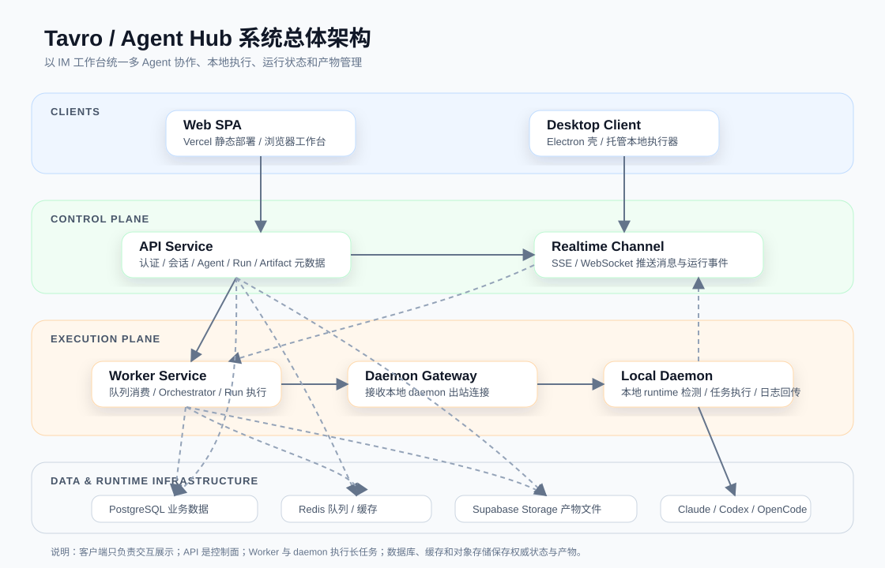
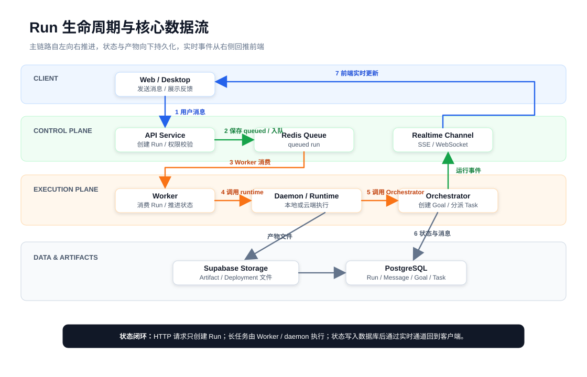

# Tavro/AgentHub 课题技术报告大纲

## 文档定位

本文档用于课题提交场景，定位为技术报告，不等同于 `apps/docs` 中面向用户的产品文档。报告主名称使用 **Tavro**，首次出现时说明 Tavro 的原型工程名与代码仓库名为 **AgentHub**。

报告主线以工程完整性为骨架，以多 Agent 协作、本地执行器、产物闭环和 AI 辅助工程协作方法作为技术创新亮点。目标篇幅约 20 页正文，附录可放关键截图、部署地址、GitHub 仓库、演示视频二维码等材料。

## 摘要

本课题名为 **Agent Hub**，产品实现命名为 **Tavro**。Agent Hub 面向大模型 Agent 从单轮问答走向持续协作、工具调用和自动化执行的趋势，设计并实现了一个基于 IM 交互范式的多 Agent 协作平台。用户可以像使用即时通讯工具一样创建会话、发送消息、@ 不同 Agent，并在同一工作流中查看任务进度、运行日志、生成文件、网页预览和部署记录。

当前 Claude Code、Codex、OpenCode 等 Agent 工具大多以命令行或单机工具形态存在，存在多人协作困难、运行过程不可视、长任务难追踪、本地环境与线上平台难协同、生成产物缺少统一管理等问题。针对这些问题，Agent Hub 将用户交互、控制面、执行面和本地运行环境进行分层设计：前端采用纯静态 Web SPA 与桌面客户端共享工作台界面；后端 API 负责认证、权限、会话历史、Agent 管理和 OpenAPI 路由；Worker 负责长任务队列消费和运行事件持久化；本地 daemon 通过出站连接接入用户电脑上的 Agent runtime；PostgreSQL、Redis 和对象存储分别承担业务数据、队列缓存和产物文件存储。

本课题最终形成了可运行的 Tavro 原型系统，已支持 GitHub 登录、单 Agent 私聊、群聊/项目会话、Agent 管理、Run 状态跟踪、结构化任务卡片、Artifact 工作区、静态站点预览、桌面客户端和本地执行器托管等能力。系统已完成线上部署，并具备演示、测试和后续扩展基础。通过该实现，Agent Hub 验证了以 IM 工作台统一多 Agent 协作、本地执行和产物管理的可行性。

## 第 1 章 课题概述

### 1.1 课题背景

近年来，大语言模型应用正在从单轮问答逐步发展为能够理解上下文、调用工具、执行多步骤任务的 Agent 系统。与传统聊天机器人相比，Agent 不再只负责生成文本回答，而是可以结合代码仓库、命令行工具、文件系统、外部 API 和自动化流程完成更复杂的工作。例如在软件开发场景中，Agent 可以阅读代码、定位问题、生成补丁、运行测试并给出修改说明；在内容生产场景中，Agent 可以生成文档、网页和结构化产物。

随着 Claude Code、Codex、OpenCode 等工具出现，命令行形态的 AI Agent 已经具备较强的本地执行能力。这类工具可以直接访问用户机器上的代码仓库和开发环境，因此在真实工程任务中具有很高价值。然而，它们通常以单机、单用户、单任务方式运行，交互入口主要是终端或独立 CLI，会话历史、任务状态、执行日志和生成产物往往分散在不同位置，难以形成面向团队协作和长期工作的统一工作台。

本课题基于上述背景提出 **Agent Hub**，并将产品实现命名为 **Tavro**。课题希望以即时通讯工具中用户熟悉的会话交互为基础，把 Agent 作为聊天成员接入工作流，让用户通过创建会话、发送消息和 @ Agent 的方式发起任务，并在同一界面中持续查看运行事件、任务拆分、生成产物和部署结果。

### 1.2 问题与需求

现有 CLI Agent 在单人本地任务中表现直接高效，但当任务复杂度提升后，会暴露出运行过程不可视、协作上下文难沉淀、本地环境与线上平台割裂、生成产物缺少统一管理等问题。一个 Agent 任务可能持续数分钟甚至更久，期间经历排队、启动、读取上下文、调用工具、生成结果和失败重试等状态。如果这些状态只散落在终端输出中，用户很难清晰判断任务当前进展，也难以在任务结束后回溯关键日志和决策过程。

从使用角色看，系统需要同时服务三类对象：普通用户是会话发起者、任务确认者和产物使用者；Agent/runtime 是任务执行者，负责调用本地或远程工具并回传消息、日志和产物；API、Worker、数据库、Redis、对象存储和实时通道等系统服务则承担控制面、执行面、持久化和同步能力。Web 与桌面端只负责交互展示和用户确认，不应承担长任务执行；daemon 也不是第二套后端，而是运行在用户本机、负责连接本地 runtime 的轻量执行器。

从功能边界看，Agent Hub 需要提供 GitHub 登录、用户会话、单 Agent 私聊、群聊、项目会话、Agent 管理、Run 状态跟踪、协调者调度、Goal/Task 拆分、Artifact 展示与发布、本地 daemon 接入、桌面端托管执行器和实时反馈等能力。复杂任务需要从用户自然语言请求拆解为阶段性目标和可执行任务，并由协调者选择合适的 Agent 推进，避免多 Agent 协作停留在聊天文本层面。这些功能共同支撑一个核心目标：让用户在同一工作台中发起任务、观察执行过程、接收 Agent 回复并管理最终产物。

从非功能边界看，系统必须保证长任务脱离 HTTP 请求生命周期，由 Worker 和 daemon 承担执行；本地执行器必须通过出站连接接入平台，避免暴露用户机器端口；Web 前端应保持纯静态 SPA，API、Worker、数据库、Redis 和对象存储应支持分离部署；Run 状态、运行事件、消息和产物元数据需要持久化，保证系统可观测、可恢复、可测试。

### 1.3 课题目标

本课题的目标是设计并实现一个名为 **Agent Hub** 的多 Agent 协作平台，产品实现名为 **Tavro**。系统以 IM 聊天作为核心交互范式，让用户可以像使用聊天工具一样创建工作会话、发送任务消息、@ 一个或多个 Agent，并在会话中持续查看任务拆分、运行进度、Agent 回复和生成产物。

在工程实现上，课题目标不是简单封装某一个 CLI Agent，而是构建一套可扩展的 Agent 工作台。系统采用 Web、API、Worker、daemon 分层架构：Web 和桌面端负责交互展示；API 作为控制面负责认证、权限、会话和元数据；Worker 在 HTTP 请求之外执行长任务并持久化运行事件；daemon 作为用户本机的轻量执行器，通过出站连接接收授权任务并调用本地 runtime。

最终，Agent Hub 希望验证一种以 IM 工作台统一多 Agent 协作、本地执行和产物管理的技术路线，使 Agent 不再只是分散的命令行工具，而是可以进入有状态、可追踪、可协作、可部署的工程工作流。

### 1.4 主要工作

围绕上述目标，本文主要完成以下工作：

- 设计聊天式多 Agent 协作模型。系统将 Agent 抽象为会话成员，支持单 Agent 私聊、群聊、项目会话和 @ Agent 交互，并通过目标、任务和结构化卡片承载多 Agent 分工结果。
- 实现分层系统架构与实时任务链路。系统拆分为 Web/Desktop、API、Worker、daemon、数据库、Redis 和对象存储等部分，使长任务执行、状态持久化和实时推送从普通 HTTP 请求中解耦。
- 实现本地 daemon 与桌面端托管能力。Daemon 负责检测和调用用户本机的 Claude Code、Codex 等 runtime；桌面客户端在复用 Web 工作台的基础上，提供本地执行器启动、状态查看和更新提醒等能力。
- 实现 Artifact 与部署预览产物闭环。系统支持在聊天流中展示生成文件、项目变更、网页预览和部署记录，并通过对象存储解决线上多容器环境中的产物共享问题。
- 完成线上部署、测试验证和演示闭环。系统已部署到 Vercel、Railway、Supabase 等平台，并通过单元测试、集成验证和线上 Demo 证明主要流程可运行。
- 沉淀面向 AI Agent 协作开发的工程规范。项目通过 `AGENTS.md` 和 `skills/` 记录架构边界、开发流程、部署经验和常见排障方法，为后续 AI Agent 参与维护和扩展提供稳定上下文。

## 第 2 章 系统总体设计

### 2.1 总体架构

系统总体架构如下图所示：

> 图源文件：`docs/report/diagrams/system-architecture.drawio`，可使用 diagrams.net 继续编辑。

该架构将系统划分为四个层次：

1. 客户端层：负责把复杂的 Agent 执行过程转化为用户可以理解和操作的工作台体验。客户端层只负责用户交互、消息展示、实时反馈和用户确认，不直接执行 Agent 任务，也不保存业务数据的权威状态。

   1.1 Web SPA：以纯静态前端形式部署在 Vercel，提供登录、会话、消息流、任务页、Artifact 工作区、Daemon 页面等核心工作台能力。

   1.2 Desktop Client：通过 Electron 复用 Web 工作台界面，并补充桌面端能力，例如系统浏览器登录、本地执行器托管和客户端更新提醒。

2. 控制面：负责认证、权限、会话、Agent、Run、Artifact 元数据、OpenAPI 路由和实时推送，关注“谁可以做什么、当前状态是什么、任务应该投递到哪里”。控制面只创建和调度任务，不在 HTTP 请求中直接执行长任务。

   2.1 API Service：承担业务控制入口，管理用户会话、权限校验、会话历史、Agent、Run、Artifact、deployment 和 daemon device 等元数据。

   2.2 Realtime Channel：通过 SSE 或 WebSocket 将消息、运行事件、任务状态和产物变化推送给 Web 与桌面端，使前端视图能够实时反映后台执行结果。

3. 执行面：负责长任务执行、协调者调度、Run 生命周期推进、本地 runtime 调用和日志回传。执行面将耗时任务从 API 请求中解耦，保证控制面保持稳定响应。

   3.1 Worker Service：消费队列中的 Run，承载协调者 Orchestrator 的目标拆分和任务分派流程，选择云端 runtime 或已连接 daemon 执行任务，并写回运行事件、消息、Goal/Task 状态和 Artifact 记录。

   3.2 Daemon Gateway：接入本地 daemon 的出站连接，负责在 Worker 和用户本机 daemon 之间传递授权后的任务与运行事件。

   3.3 Local Daemon：运行在用户电脑上，检测本地 runtime，接收经过授权的任务，调用本地 Claude Code、Codex 等工具，并回传日志、消息、文件和状态。daemon 不负责用户系统、会话历史或全局权限判断，因此不是第二套后端。

   3.4 Agent Runtimes：包括 Claude Code、Codex、OpenCode 等实际执行工具，负责完成代码、文档、网页、项目文件等具体任务。

4. 数据与基础设施层：负责保存权威状态和生成产物，支撑系统恢复、队列缓存、临时状态和跨服务文件共享。

   4.1 PostgreSQL：保存用户、会话、消息、Run、Goal/Task、Artifact、deployment 和 daemon device 等业务数据。

   4.2 Redis：支撑队列、缓存、临时 OAuth state、桌面登录 code 和实时协调。

   4.3 Supabase Storage：保存 Artifact、静态站点和 deployment 文件，避免 API/Worker 分离部署后依赖单个容器本地磁盘。

### 2.2 核心数据流

Run 生命周期与核心数据流如下图所示：

> 图源文件：`docs/report/diagrams/run-lifecycle.drawio`，可使用 diagrams.net 继续编辑。

Tavro 的一次 Agent 执行不是由前端直接调用某个 CLI 完成，而是被抽象为一个可持久化、可排队、可观察的 Run。Run 是用户消息进入执行系统后的核心状态载体：它记录任务从排队、运行到成功或失败的生命周期，也把消息、Goal/Task、运行事件和 Artifact 串联成同一条可追踪链路。

该数据流的关键设计是将控制面请求和长任务执行解耦。用户发送消息时，API 只负责完成权限校验、消息持久化、Run 创建和队列投递，不在 HTTP 请求中等待 Agent 执行完成。真正的耗时任务由 Worker 消费队列后继续推进，并根据 Agent 与 runtime 的绑定关系选择本地 daemon 或云端 runtime。这样可以避免长任务阻塞普通 API 请求，也便于系统在失败、重试、刷新页面或多端查看时恢复状态。

核心流程：

1. 用户在会话中发送消息。
2. API 创建 Run，保存 queued 状态并投递队列。
3. Worker 消费 Run，选择本地 daemon 或云端 runtime。
4. Daemon 或云端 runtime 接收任务并开始执行，产生运行事件和中间状态。
5. 需要多 Agent 协作时，runtime 调用协调者 Orchestrator，根据会话上下文创建 Goal，并在 Goal 下分派多个 Task 给不同 Agent。
6. API/Worker 持久化数据，并通过实时事件推送给前端。
7. 前端更新消息流、Goal/Task 状态和产物视图。

在执行过程中，文本回复、结构化卡片、任务状态和 Artifact 元数据写入 PostgreSQL，生成文件、静态站点和 deployment 文件写入 Supabase Storage。实时通道只承担事件推送职责，不作为权威存储；前端收到事件后更新消息流、任务页和产物视图。如果前端刷新或断线重连，也可以重新从 API 读取数据库中的权威状态。通过这种方式，系统形成了“用户消息创建 Run、Worker 推进执行、runtime 产生产物、数据库保存状态、实时通道反馈前端”的闭环。

### 2.3 Daemon 连接与任务分发

建议配图：Daemon 连接与任务分发图。

- Daemon 与 Worker gateway 建立出站 WebSocket 连接。
- API 为 daemon 设备生成 token，Worker 校验设备身份。
- Worker 根据 Agent/runtime 绑定关系将 Run 分发到对应 daemon。
- Daemon 执行本地 CLI runtime，并将事件流式回传。

## 第 3 章 关键技术与创新点

### 3.1 IM 化多 Agent 协作范式

- Agent 作为聊天成员参与会话。
- 用户可以在群聊中 @ 一个或多个 Agent。
- 协调者 Orchestrator 是群聊协作中的调度角色，负责理解用户意图、维护任务上下文、拆解目标并选择参与 Agent。
- Goal 表示从用户意图中抽取出的阶段性目标，Task 是 Goal 下可分派、可跟踪、可执行的工作单元。
- Orchestrator 不替代具体 Agent 执行任务，而是在多个 Agent 之间分配工作、跟踪状态并汇总协作过程。
- 自动派发消息使用结构化卡片展示 Goal/Task 创建和分派过程，而不是只依赖纯文本。

### 3.2 本地 daemon 执行模型

- Daemon 通过出站 WebSocket 接入平台，不要求用户开放本地端口。
- Runtime registry 检测本机 Claude Code、Codex 等 CLI 工具。
- Daemon 封装本地进程执行、workspace root、日志采集和取消任务。
- 桌面客户端可托管 `npx @tavro-ai/daemon@latest connect`，降低用户接入成本。

### 3.3 长任务异步执行与实时反馈

- API 和 Worker 解耦，避免 HTTP 请求直接承载长任务。
- Redis 用于队列、缓存和实时协调。
- RunEvent 持久化记录任务运行过程。
- 前端通过 SSE/WebSocket 接收实时更新，展示排队、运行、失败、完成等状态。

### 3.4 Artifact 与产物闭环

- Agent 输出不仅是文本，也包括文件、项目变更、网页预览和部署记录。
- 对象存储解决 API/Worker 多容器环境下本地磁盘不共享的问题。
- Artifact 元数据保存在数据库中，文件内容保存在 Supabase Storage 中。
- 用户可在聊天流中预览、编辑、发布和追踪生成产物。

### 3.5 前端体验设计

- 使用 TanStack Query 管理 server state，降低重复请求和页面切换延迟。
- 用户消息采用 optimistic 入列，提升发送后的即时反馈。
- Welcome dashboard、任务状态聚合和右下角实时提醒改善工作台感知。
- Web 与桌面端共享同一业务界面，桌面端额外提供本地 daemon 托管能力。

## 第 4 章 系统详细设计与实现

### 4.1 前端实现

- 技术栈：Vite、React、TypeScript、Carbon Design System、Tailwind CSS。
- 核心模块：工作台布局、会话侧边栏、消息流、任务页、Artifact 工作区、Daemon 页面。
- Goal/Task 在前端通过任务页、状态聚合视图和聊天流卡片展示；用户可从卡片跳转到对应目标或任务。
- 状态管理：TanStack Query 管理服务端数据，本地 state 管理弹窗、草稿、选中态和交互状态。
- 实时更新：接收消息、Run、任务、Artifact 等事件并同步更新 UI。

### 4.2 API 实现

- 技术栈：Hono、Node.js、`@hono/zod-openapi`。
- 路由采用 `createRoute + app.openapi(...)` 暴露 OpenAPI 文档。
- API 模块包括 auth、agents、conversations、runs、daemon、artifacts、deployments、search 和 realtime。
- 协调者相关操作通过会话、Run、Goal/Task 和消息接口串联，不作为独立第二套执行服务。
- API 是控制面，负责权限校验、状态持久化和任务投递，不直接执行长任务。

### 4.3 数据层实现

- PostgreSQL 保存用户、OAuth 账户、会话、消息、Run、Artifact、deployment 和 daemon device 等数据。
- Goal/Task 数据与会话、消息和 Run 关联，结构化卡片消息用于记录目标创建和任务分派过程。
- Drizzle ORM 管理 schema 与迁移。
- Redis 用于队列、缓存、临时 OAuth state、desktop login code 和实时协调。
- Supabase Storage 存储生成产物、静态站点文件和 deployment 文件。

### 4.4 Worker 实现

- Worker 消费 Run 队列并负责长任务执行。
- Worker 在群聊或项目会话中承载协调者调度流程，将目标拆解、任务分派和状态推进写回会话。
- 对本地任务，Worker 通过 daemon gateway 将任务分发给在线 daemon。
- Worker 持久化 RunEvent、message、goal/task、artifact 和 deployment 记录。
- Worker 在任务分派和状态变化时发布实时事件，使聊天流卡片和任务页保持同步。
- Worker 在数据变更后触发相关会话、任务和产物缓存失效。

### 4.5 Daemon 实现

- Daemon 检测本地 runtime，例如 Claude Code、Codex。
- Daemon 封装 CLI 进程执行、日志流、取消任务和错误归一化。
- MCP stdio relay 负责连接本地 MCP 工具能力。
- Workspace root 限制本地文件访问范围。
- Windows shell/stdin 差异需要在 runtime adapter 层处理。

### 4.6 桌面客户端实现

- Electron 客户端作为 Web 壳复用线上或本地 Web SPA。
- GitHub 登录通过系统浏览器完成，再回跳桌面客户端。
- 桌面端托管本地 `npx @tavro-ai/daemon@latest connect`。
- 客户端支持检查更新，安装包通过 GitHub Release 分发。

## 第 5 章 部署方案与工程化

### 5.1 线上部署拓扑

建议配图：生产部署拓扑图。

- Web：Vercel。
- API/Worker/Redis：Railway。
- Database：Supabase PostgreSQL。
- Object Storage：Supabase Storage。
- Daemon：npm 包 `@tavro-ai/daemon`。
- Desktop：GitHub Release。

### 5.2 环境变量与配置

需要说明的配置包括：

- GitHub OAuth client id、client secret 和 callback URL。
- CORS/Web origin。
- Database URL。
- Redis URL。
- daemon token secret。
- Supabase Storage bucket 和 service role。

### 5.3 CI/CD 流程

建议配图：CI/CD 发布流程图。

- main 分支触发 Vercel/Railway 平台自动部署。
- promote workflow 控制 dev 到 main 的发布入口。
- Supabase migration workflow 负责生产数据库迁移。
- daemon publish workflow 负责 npm 包发版。
- desktop release workflow 负责三端桌面安装包构建和 GitHub Release。

## 第 6 章 AI 协作方法与工程规范

### 6.1 方法设计背景

- 本课题本身是多 Agent 协作平台，同时开发过程也大量使用 AI Agent 辅助编码、排障、文档和部署。
- 为避免 AI Agent 在复杂 monorepo 中偏离架构边界，需要将项目知识、工程约束和常用流程显式文档化。
- 项目采用“项目级总规范 + 任务型技能文档”的方式，让 AI Agent 能够持续复用上下文，而不是每次从零理解仓库。

### 6.2 `AGENTS.md` 项目级协作契约

- `AGENTS.md` 记录 Tavro/AgentHub 的产品模型、架构原则、运行边界和代码组织方式。
- 文档明确 Web、API、Worker、Daemon、Desktop、packages 之间的职责边界，减少 AI Agent 把逻辑放错层的风险。
- 文档规定 API route 使用 OpenAPI `createRoute` 风格、后端领域逻辑优先放入 `packages/server`、共享协议放入 `packages/core`。
- 文档还沉淀测试约定、本地基础设施、当前实现状态和后续优先级，作为 AI Agent 接手任务前的公共上下文。

### 6.3 `skills/` 任务型技能文档

- `skills/` 目录将高频任务沉淀为可复用工作流，每个 skill 使用 `SKILL.md` 描述触发场景、核心原则、常用流程、验证命令和易错点。
- 当前项目包含开发流程、前端体验、生产部署、CI 排障、daemon 发版等技能。
- skill 与 `AGENTS.md` 的关系是分层互补：`AGENTS.md` 约束全局架构和边界，skill 约束具体任务执行方式。
- 这种方法让后续 AI Agent 在处理 UI 打磨、部署、发版、CI 失败等任务时，能够快速进入正确工作模式。

### 6.4 AI 协作开发流程

- 需求不明确时先设计计划，再进入实现。
- 实现前先阅读相关代码和仓库状态，避免凭空假设。
- 修改保持小步提交，每次变更后运行对应范围的 lint、typecheck、test 或全量 `pnpm check`。
- 涉及部署、OAuth、CI、daemon 发版等高风险任务时，优先通过 skill 中的检查清单执行。
- 所有关键经验在问题解决后反向沉淀到 `AGENTS.md` 或对应 skill 中，形成持续改进闭环。

### 6.5 方法价值

- 降低大型 TypeScript monorepo 中 AI 协作的上下文损耗。
- 提升跨前端、后端、worker、daemon、桌面端任务的一致性。
- 将一次性排障经验转化为可复用流程，减少重复错误。
- 为课题本身提供一种“用 AI Agent 构建 AI Agent 平台”的工程实践样例。

## 第 7 章 系统测试与验证

### 7.1 单元测试

- core 协议类型和纯逻辑。
- server cache/storage。
- API auth/routes。
- daemon runtime/MCP。
- worker daemon gateway。

### 7.2 集成验证

- GitHub 登录。
- 发送消息并创建 Run。
- 创建 Goal、分派 Task，并验证 Task 状态从运行到成功或失败。
- daemon 在线检测。
- Agent 执行并回传消息。
- 聊天流 Goal/Task 卡片与任务页状态同步。
- Artifact 上传、读取、编辑和发布。
- 静态站点部署预览。

### 7.3 线上 Demo 验证

建议放置：

- Tavro Web 地址。
- Tavro Docs 地址。
- GitHub 仓库地址。
- 演示视频二维码或链接。
- 关键截图：登录页、Welcome、会话、任务、Artifact、Daemon、桌面端。

### 7.4 性能与稳定性说明

- Redis 缓存降低重复读压力。
- TanStack Query 降低前端重复请求和切换等待。
- 对象存储解决多容器本地文件丢失。
- Worker 避免长任务阻塞 API。
- 桌面托管 daemon 降低本地执行器接入失败率。

## 第 8 章 总结与展望

### 8.1 已完成成果

- 完整多 Agent IM 工作台原型。
- Web、API、Worker、Daemon、Desktop 端到端链路。
- 线上部署和可演示 Demo。
- 支持本地执行器、Artifact、任务状态和静态站点预览。
- 形成 `AGENTS.md` 与项目 skills 结合的 AI 协作开发方法。

### 8.2 当前不足

- 云端 Agent 执行能力仍可继续增强。
- Artifact 托管可以升级为独立部署服务。
- 桌面端签名、自动更新和本地文件能力仍需完善。
- 权限、审计、团队协作和计费能力尚未产品化。
- AI 协作规范仍需要随着项目演进持续补充和验证。

### 8.3 后续方向

- 支持多 workspace 和团队协作。
- 完善 project file 权限模型。
- 建设独立静态托管服务。
- 扩展更多 Agent runtime adapter。
- 探索移动端远程控制体验。
- 将更多项目经验沉淀为可复用 skill，并探索自动化触发机制。

## 附录建议

### 附录 A 核心数据库表说明

建议列出 users、oauth_accounts、conversations、conversation_messages、conversation_runs、conversation_artifacts、conversation_deployments、daemon_devices 等核心表。

### 附录 B 主要 API 模块列表

建议按 auth、agents、conversations、runs、daemon、artifacts、deployments、search、realtime 等模块整理。

### 附录 C 关键环境变量表

建议列出生产部署所需的 GitHub OAuth、Database、Redis、Web origin、daemon token、Supabase Storage 等变量。

### 附录 D 部署与演示材料

建议包含线上地址、仓库地址、演示账号说明、演示视频二维码或链接。

### 附录 E 关键截图

建议包含登录、Welcome、会话、任务、Artifact、Daemon、桌面端和部署预览截图。

### 附录 F AI 协作规范材料

建议摘录或引用 `AGENTS.md`、关键 `SKILL.md`、AI 协作任务流程和典型问题修复记录。

## 写作约定

- 正文优先使用中文。
- 产品名统一使用 Tavro。
- 首次出现时说明：Tavro 的原型工程名与代码仓库名为 AgentHub。
- 本报告独立于 `apps/docs` 产品文档站，建议存放在 `docs/report/`。
- 后续扩写时优先补架构图、时序图、部署图和关键截图。
